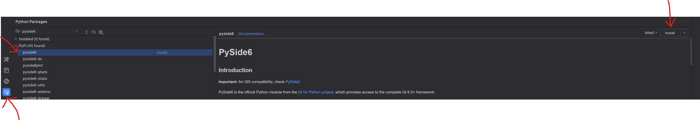
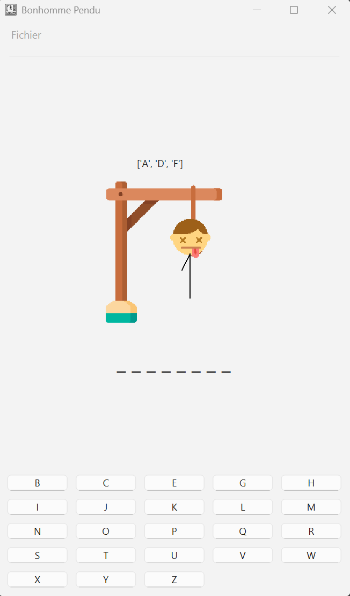

# 420-SF1-RE Travail Pratique 2
Ce travail pratique compte pour 15% de la note finale et doit être fait en équipe de 2 ou 3. Aucun travail solo ne sera
accepté.

# Gestion de notes (60 points)

## Contexte
Un professeur veut gérer les notes de 5 étudiants. Pour chaque étudiant, on doit stocker dans des listes séparées : 

- noms
- prénoms
- tp1
- tp2
- exercice1
- exercice2
- examen1
- examen2

Toutes les notes sont sur 100.

## Format d'entrée attendu
À saisir 5 fois, une pour chaque étudiant :

Message à afficher (exact) :

```Donnez les informations de l'étudiant X :```
où x est la séquence de l'étudiant étant saisi : 1, 2, 3, 4, 5

### Format d'une saisie valide :
```Nom : Prénom : tp1 : tp2 : exercice1 : exercice2 : examen1 : examen2```

#### Exemples valides (espaces avant/après les deux-points acceptés) :
```Alain : Topo : 80 : 90.50 : 100 : 90 : 90 : 80```

#### Exemples invalides (nombre de champs incorrect) :
```Alain :Topo :80 :90.50 :100 :90 :90``` (manque une note)

```Alain :Topo :80 :90.50 :100 :90 :90 :80 :60``` (trop de champs)

#### Remarques sur la saisie :
Les champs nom/prénom sont des chaînes; les notes doivent être converties en nombres (float).

Si la saisie n'a pas exactement 8 champs séparés par des deux-points, refuser et redemander.

### Pondérations (pour le calcul de la moyenne)
```
tp1 : 15%
tp2 : 20%
examen1 : 25%
examen2 : 30%
exercice1 : 5%
exercice2 : 5%
```

### Affichage demandé pour la fonctionnalité #2 et #7
```
Nom et Prénom : x y
Tp 1 et Tp2: x y
Exercice 1 et Exercice 2 : x y
Examen 1 et Examen 2 : x y
Moyenne de l'étudiant : x
```
où x et y sont les valeurs appropriées provenant des listes.


## Fonctionnalités à implémenter (60 points)
À implémenter dans le module ```gestion_notes.py``` 
1. (10 points) Saisir et peupler les listes pour 5 étudiants en respectant le format et la validation.
2. (10 points) Écrire une fonction ```afficher_info()``` qui affiche toutes les informations d'un étudiant et sa moyenne
(format ci‑dessus). Vous choisissez les arguments à passer à la fonction.
3. (10 points) Afficher le(s) nom(s) des étudiant(s) ayant la meilleure moyenne générale.
4. (5 points) Écrire une fonction qui calcule et affiche la moyenne de la classe.
5. (10 points) Écrire une fonction qui calcule et affiche l'écart-type des moyennes des étudiants, vous devez faire le
calcul manuellement de l'écart-type (il est interdit d'utiliser ```stdev()```). Pour rappel, l'écart type utilise la formule suivante: 

6. (10 points) Identifier les étudiants ayant réussi et échoué selon le système de double seuil :
*Réussite si moyenne pondérée des tps+exercices >= 60% ET moyenne pondérée des examens >= 60%.*
7. (5 points) Trier les étudiants par moyenne générale (ordre croissant) et afficher le résultat selon le format de la question 2.

## Contraintes d'exécution
- Exécuter l'ensemble des fonctions à l'exécution du programme.
- Avant chaque question afficher exactement :
```
---------------- Question X --------------------
```
(remplacer X par le numéro de la fonctionnalité)

- Le programme doit être correctement commenté (nom, prénom, description des fonctions, etc.).
- L'interaction utilisateur doit respecter les messages demandés; tout écart peut entraîner une pénalité.
- Le non-respect des consignes, une mauvaise interaction entre l’utilisateur et la machine (messages affichés non compréhensibles)
entraine une sanction systématique du ¼ de la note tout en faisant abstraction de la logique du programme.


# Exercice Bonus - Bonhomme Pendu (15 points)
Il est possible d'obtenir des points bonis en complétant cet exercice bonus. Cet exercice vaut 15 points, mais la note finale du travail pratique ne pourra pas dépasser 70.  

## Contexte
Vous devez implémenter la logique du jeu bonhomme pendu. Le bonhomme pendu est un jeu où l'on cherche à deviner un mot
en essayant une lettre à chaque tour. Si la lettre n'appartient pas au mot à deviner, une partie du corps est ajoutée au bonhomme. 
Vous n'avez aucune interaction avec l'usager à implémenter,
une interface graphique vous est fournie.

## Mise en place
L'interface graphique est implémenté en utilisant le package externe ``PySide6``, utilisant la bibliothèque C++ Qt.
Pour installer le package:
- assurez-vous d'avoir créé un environnement virtuel (venv)
- dans Pycharm, utiliser la vue *Python Packages*, rechercher *PySide6* et cliquer *install*



## Implémentation

Vous devrez implémenter trois fonctions dont le gabarit vous est fourni. Vous ne pouvez pas changer la signature des fonctions (nom. arguments)
### Fonctions à implémenter
```
def choisir_mot(mots_dictionnaire: list[str]) -> str:
```
- Remplacer le *pass* par votre implémentation
- Cette fonction établie la liste de mots possibles et en retourne un mot au hasard
- l'argument *mots_dictionnaire* est une liste de str contenant des mots du dictionnaire
- Vous devez choisir au hasard à partir de seulement les mots de 6 caractères ou plus 
- Les mots de la liste se terminent par le caractère "\n", vous devez le supprimer avant de calculer la longueur ou le retourner

```
def tour_jeu(lettre: str, mot_a_deviner: str, lettres_utilisees: list, lettres_restantes: list, essais_restants: int):
```
- Remplacer le *pass* par votre implémentation
- Cette fonction vérifie si la *lettre* appartient au *mot_a_deviner* et met à jour les listes passées en paramètres et le nombre d'*essais_restants*
- Si la *lettre* n'appartient pas au *mot_a_deviner*, le nombre d'*essais_restants* doit être décrémenté de 1
- la *lettre* doit être ajoutée à la liste *lettres_utilisees* et enlever de la liste *lettres_restantes*
- Vous devez construire la str qui sera affichée pour deviner le mot
  - Si la lettre n'a pas été devinée, vous devez la remplacer par ```_```, sinon la lettre est affichée
  - Il doit y avoir un espace entre chaque lettre du puzzle
  - ex si le mot à deviner est "CAISSE" et que la personne a essayé la lettre "S" après le début de la partie, le puzzle à construire serait
    - ``_ _ _ S S _``
- La fonction doit retourner dans cet ordre
  - puzzle
  - essais_restants

```
def recommencer_partie()
```
- Cette fonction initialise les listes de lettres pour une nouvelle partie
- Cette fonction doit retourner dans cet ordre
  - ```lettres_restantes```
    - Une liste de toutes les majuscules de A à Z
    - Vous devez la définir en utilisant une liste en compréhension
  - ```lettres_utilisées```
    - liste vide

### Exemple de l'interface
